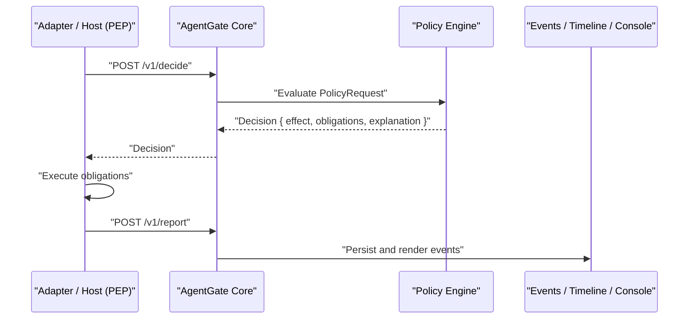
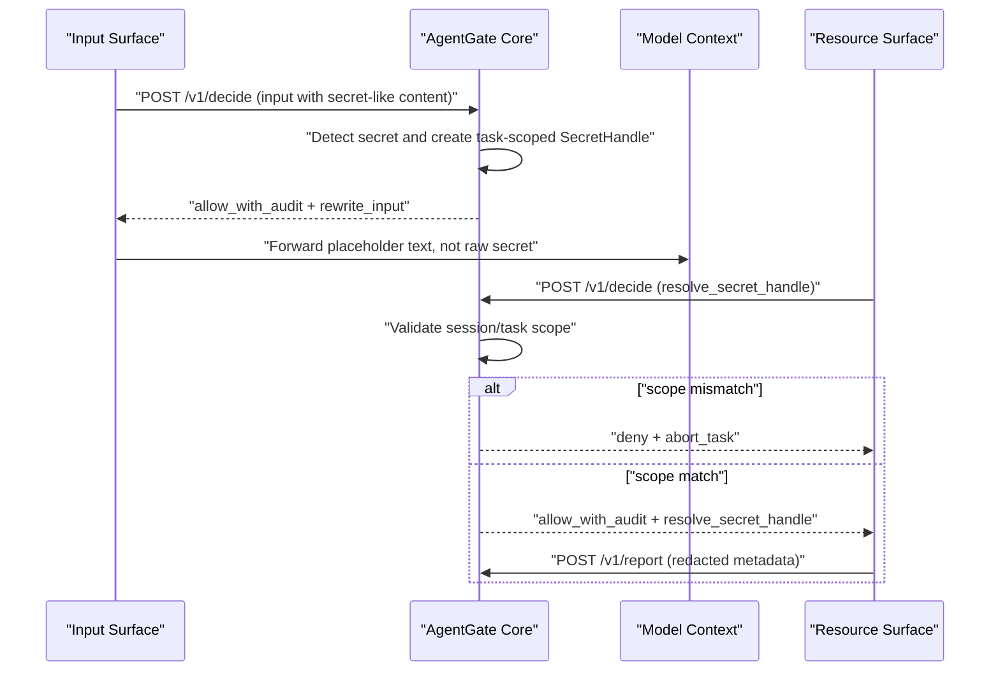
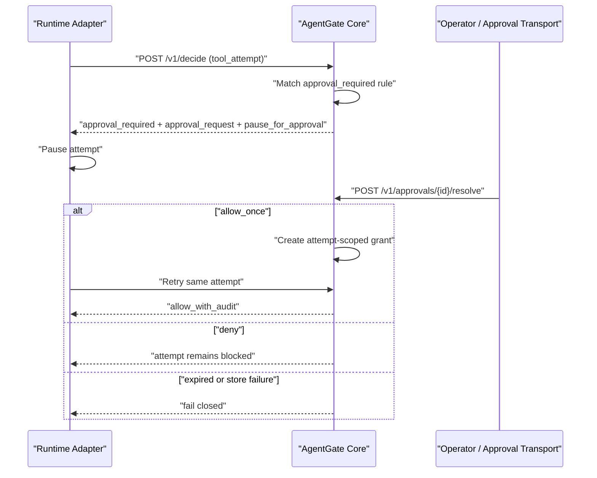
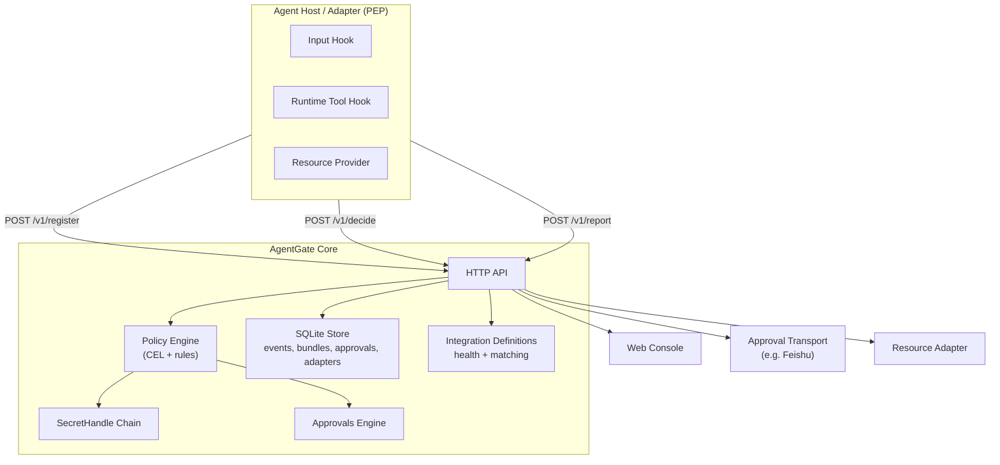
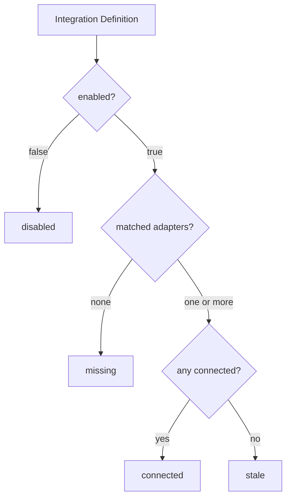

# AgentGate

**Policy decision and control plane for agent input, runtime action, and resource boundaries.**

AgentGate is a security admission controller for agentic systems. Agent hosts submit structured intent at critical boundaries: model input, tool execution, and resource access. AgentGate evaluates policy and returns an executable decision with obligations. It is not an agent runtime, not an SDK helper, not an OS sandbox, and not a DLP filter.



---

## Enforcement Surfaces

AgentGate enforces policy at connected surfaces. Coverage gaps are visible, not hidden.

**`input`** - Intercepts model input before it reaches the model. Handles secret detection, taint classification, input rewrite, and SecretHandle creation.

**`runtime`** - Intercepts tool calls before execution. Evaluates bash, network egress, filesystem writes, process spawns, and other high-risk side effects. High-risk actions require approval by default.

**`resource`** - Intercepts resource access and SecretHandle resolution before the adapter retrieves real values. Enforces task-scoped secret access.

Supporting channels, such as approval transports, notification, audit rendering, and the web console, are not enforcement surfaces and do not make security decisions.

---

## Policy Model

Policies are organized into **Bundles**, each containing ordered **Rules**. Active bundles run in priority order; within a bundle, rules run in rule priority order.

**Effects**

| Effect | Behavior |
|---|---|
| `allow` | Permit the action. |
| `allow_with_audit` | Permit and emit an audit event. |
| `deny` | Block the action. |
| `approval_required` | Pause the attempt pending operator approval. |
| `exclusion` | Explicit exclusion effect with block semantics. |

**Conditions** are [CEL](https://github.com/google/cel-spec) expressions against the request fact model and Core-owned session facts.

**Obligations** are actions executed on match: redact audit fields, rewrite input, create a SecretHandle, request approval, pause or abort a task.

AgentGate fails closed on invalid requests, missing active policy, CEL indeterminate results, and missing secret policy.

### Default Policy

The default policy (`config/default_policy.json`) ships with these rules:

- `input` secret-like content -> rewrite to SecretHandle
- `runtime` bash -> approval required
- `runtime` open-world actions -> approval required
- `runtime` high-risk side effects (filesystem write, network egress, process spawn, secret resolve) -> approval required
- `resource` SecretHandle resolve -> allow with audit, subject to task/session scope match

---

## SecretHandle Flow



---

## Runtime Approval Flow



---

## Architecture



**Core** - Go + chi HTTP service. SQLite persistence via `modernc.org/sqlite`. Bearer token authorization with three roles: `adapter`, `operator`, `admin`. Strict JSON decoding; unknown fields return 400.

**Integration model** - Three distinct layers:

| Layer | What it represents |
|---|---|
| Adapter Registration | Who is actually connected right now |
| Integration Definition | Who the operator expects to be connected |
| Policy / Admission | Which requests are accepted and what obligations apply |

---

## API

| Method | Path | Role | Description |
|---|---|---|---|
| `POST` | `/v1/register` | adapter | Register adapter and declare surfaces |
| `POST` | `/v1/decide` | adapter | Submit a PolicyRequest, receive a Decision |
| `POST` | `/v1/report` | adapter | Report attempt outcome |
| `GET` | `/v1/coverage` | operator | Surface coverage summary |
| `GET` | `/v1/events` | operator | Security event log |
| `GET` | `/v1/approvals` | operator | Pending approvals |
| `POST` | `/v1/approvals/{id}/resolve` | operator | Allow or deny an approval |
| `*` | `/internal/policy/*` | admin | Bundle and rule management |
| `*` | `/internal/integrations/*` | admin | Integration definition management |

### PolicyRequest

```json
{
  "request_id": "req_01",
  "request_kind": "tool_attempt",
  "actor": {
    "user_id": "u1",
    "host_id": "openclaw"
  },
  "session": {
    "session_id": "sess_01",
    "task_id": "task_01",
    "attempt_id": "att_01"
  },
  "action": {
    "tool": "bash",
    "operation": "execute",
    "side_effects": ["process_spawn", "network_egress"],
    "open_world": true
  },
  "target": {
    "kind": "process",
    "identifier": "/bin/sh"
  },
  "content": {
    "summary": "...",
    "data_classes": []
  },
  "context": {
    "surface": "runtime",
    "taints": ["untrusted_external"],
    "raw": {}
  }
}
```

### Decision

```json
{
  "decision_id": "dec_01",
  "request_id": "req_01",
  "effect": "approval_required",
  "reason_code": "runtime_high_risk_requires_approval",
  "obligations": [
    {
      "type": "approval_request",
      "params": {
        "approval_id": "appr_01",
        "scope": "attempt"
      }
    },
    {
      "type": "task_control",
      "params": {
        "action": "pause_for_approval"
      }
    }
  ],
  "explanation": {
    "summary": "Runtime attempt has high-risk side effects and requires an attempt-scoped approval."
  },
  "decided_at": "2026-04-29T00:00:00Z"
}
```

---

## Adapters

**OpenClaw** (`packages/openclaw-adapter`) - Host plugin adapter. Registers `input` and `runtime` surfaces. Maps OpenClaw input and tool events to PolicyRequests. Executes `rewrite_input`, `block`, and approval obligations. Accepts optional `integration_id` for Definition matching.

**Feishu** (`packages/feishu-adapter`) - Approval transport channel. Polls pending approvals, sends interactive Feishu cards, resolves approvals via card callback. Not an enforcement surface.

**Resource** (`packages/resource-adapter`) - Registers `resource` surface. Resolves SecretHandles through AgentGate policy evaluation.

### Writing an Adapter

An adapter is any service that:

1. Calls `POST /v1/register` on startup with its surfaces and `integration_id`.
2. Calls `POST /v1/decide` before executing any action at a covered surface.
3. Executes the returned obligations exactly as specified.
4. Calls `POST /v1/report` with the outcome.

AgentGate does not call adapters. Adapters call AgentGate.

---

## Web Console

The console connects to a live AgentGate Core instance. All data is real; there is no mock layer.

**Events** - Filterable security event log with decision detail: matched rules, applied rules, obligations, evidence, taints, and data classes.

**Timeline** - Trace-oriented view of event volume and span detail across sessions and tasks.

**Approvals** - Pending approval queue. Allow once (attempt-scoped) or deny.

**Policy** - Bundle and rule management. CEL rule editor with fact model completion. Validate, save, publish, archive.

**Integrations** - Integration Definition management. Live adapter matching, surface coverage, and health status (`connected` / `stale` / `missing` / `disabled`). Health is computed by Core; the console renders it.

**Settings** - AgentGate base URL and token configuration, stored locally in the browser.

---

## Integration Health

AgentGate computes health status for each Integration Definition by matching against live adapter registrations via `integration_id`.



For multi-instance deployments, the best healthy instance wins. An adapter that registers without a matching Definition is shown in live adapter views and does not make any Definition healthy.

---

## Development

**Requirements** - Go 1.22+, Node.js 20+, Bun.

```bash
# Run tests
go test ./...

# Type-check all TypeScript workspaces
bun run typecheck

# Build all TypeScript workspaces
bun run build

# Start Core (development)
go run ./cmd/agentgate

# Start console (development)
cd web && bun run dev
```

**Token roles**

| Role | Scope |
|---|---|
| `adapter` | `/v1/register`, `/v1/decide`, `/v1/report` |
| `operator` | `/v1/coverage`, `/v1/events`, `/v1/approvals` |
| `admin` | `/internal/*` and all operator endpoints |

Configure tokens with environment variables:

```bash
export AGENTGATE_ADAPTER_TOKENS=adapter-local-token
export AGENTGATE_OPERATOR_TOKENS=operator-local-token
export AGENTGATE_ADMIN_TOKENS=admin-local-token
```

See `config/default_policy.json` for the default policy bundle.
